# Solución al Desafío - Collage de imágenes

Repositorio con el código solución al desafío 2: Collage de Imagenes del módulo 8 **Implementación de API backend Node Express** de la beca **Desarrollo de aplicaciones Full Stack Javascript Trainee** dada por Talento Digital para Chile y dictada por Desafío Latam.

Nuevamente he ido mucho más allá de lo solicitado realizado lo siguiente adicional:

-Proyecto 100% Responsivo
-Eliminación de Cache de modo de actualizar el front end de manera inmediata ante cambios en el servidor
-Dos maneras de Resetear la data ya sea mediante ruta o mediante intervalo de tiempo
-Creación de vistas 404 (ruta no encontrada) y 413(archivo supera el límite máximo permitido de 5 MB)

## Tabla de Contenidos

- [Solución al Desafío - Collage de imágenes](#solución-al-desafío---collage-de-imágenes)
  - [Tabla de Contenidos](#tabla-de-contenidos)
  - [Requisitos](#requisitos)
  - [Proyecto 100% Responsivo](#proyecto-100-responsivo)
    - [Proyecto en Pantallas Grandes](#proyecto-en-pantallas-grandes)
      - [1-Home en Pantallas Grandes](#1-home-en-pantallas-grandes)
      - [2-Collage en Pantallas Grandes](#2-collage-en-pantallas-grandes)
      - [3-404 en Pantallas Grandes](#3-404-en-pantallas-grandes)
      - [4-413 en Pantallas Grandes](#4-413-en-pantallas-grandes)
    - [Proyecto en Pantallas Small](#proyecto-en-pantallas-small)
      - [1-Home en Pantallas Small](#1-home-en-pantallas-small)
      - [2-Collage en Pantallas Small](#2-collage-en-pantallas-small)
      - [3-404 en Pantallas Small](#3-404-en-pantallas-small)
      - [4-413 en Pantallas Small](#4-413-en-pantallas-small)
  - [Diagrama de Flujo](#diagrama-de-flujo)
    - [1-Carga de Imagen](#1-carga-de-imagen)
    - [2-Muestra en collage page de imagen cargada](#2-muestra-en-collage-page-de-imagen-cargada)
    - [3-Collage Completado](#3-collage-completado)
    - [4-Collage Completado Small Screen](#4-collage-completado-small-screen)
    - [5-Collage Recompletado con nuevas imagenes](#5-collage-recompletado-con-nuevas-imagenes)
  - [Soluciones](#soluciones)
    - [1. Integrar express-fileupload a Express. (1 Punto)](#1-integrar-express-fileupload-a-express-1-punto)
    - [2. Definir que el límite para la carga de imágenes es de 5MB. (2 Puntos)](#2-definir-que-el-límite-para-la-carga-de-imágenes-es-de-5mb-2-puntos)
    - [3. Responder con un mensaje indicando que se sobrepasó el límite especificado. (2 Puntos)](#3-responder-con-un-mensaje-indicando-que-se-sobrepasó-el-límite-especificado-2-puntos)
    - [4. Crear una ruta POST /imagen que reciba y almacene una imagen en una carpeta pública del servidor. Considerar que el formulario envía un payload con una propiedad “position”, que indica la posición del collage donde se deberá mostrar la imagen. (3 Puntos)](#4-crear-una-ruta-post-imagen-que-reciba-y-almacene-una-imagen-en-una-carpeta-pública-del-servidor-considerar-que-el-formulario-envía-un-payload-con-una-propiedad-position-que-indica-la-posición-del-collage-donde-se-deberá-mostrar-la-imagen-3-puntos)
    - [5. Crear una ruta DELETE /imagen/:nombre que reciba como parámetro el nombre de una imagen y la elimine de la carpeta en donde están siendo alojadas las imágenes. Considerar que esta interacción se ejecuta al hacer click en alguno de los números del collage. (2 Puntos)](#5-crear-una-ruta-delete-imagennombre-que-reciba-como-parámetro-el-nombre-de-una-imagen-y-la-elimine-de-la-carpeta-en-donde-están-siendo-alojadas-las-imágenes-considerar-que-esta-interacción-se-ejecuta-al-hacer-click-en-alguno-de-los-números-del-collage-2-puntos)
  - [Extra](#extra)

## Requisitos

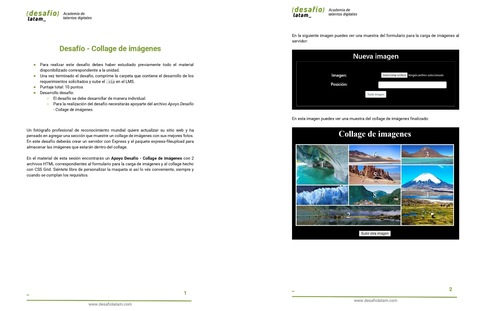
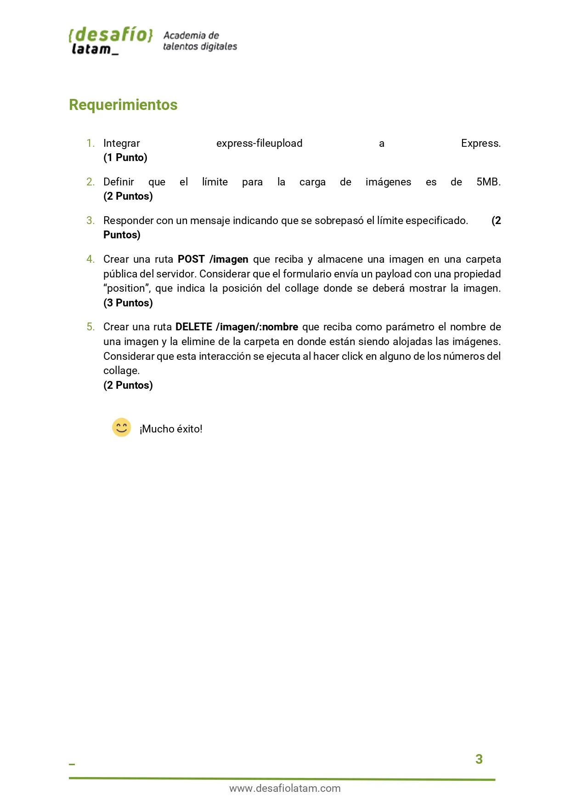

## Proyecto 100% Responsivo

### Proyecto en Pantallas Grandes

#### 1-Home en Pantallas Grandes

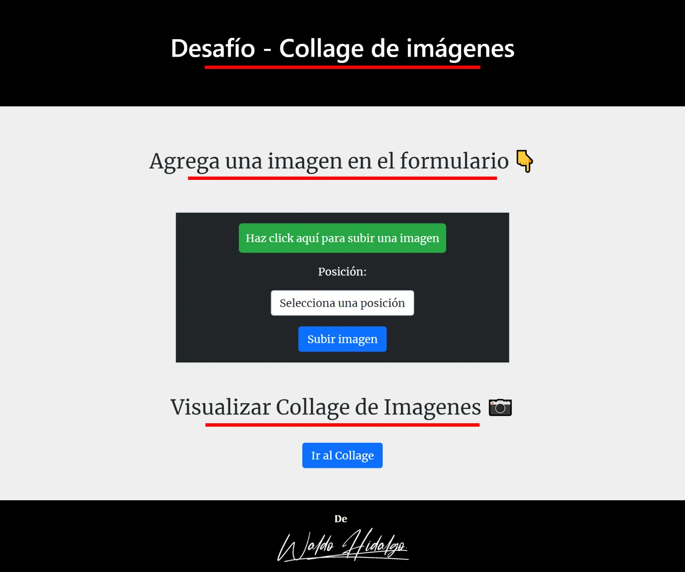

#### 2-Collage en Pantallas Grandes

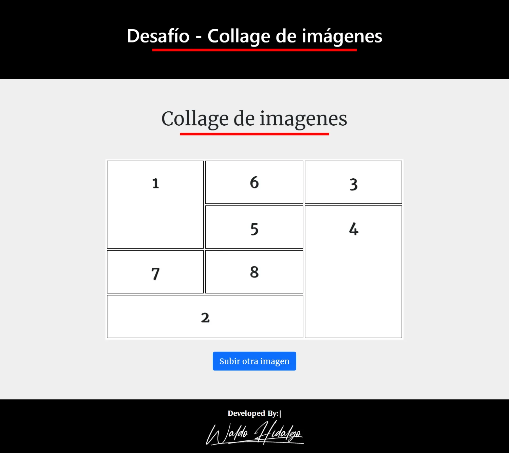

#### 3-404 en Pantallas Grandes

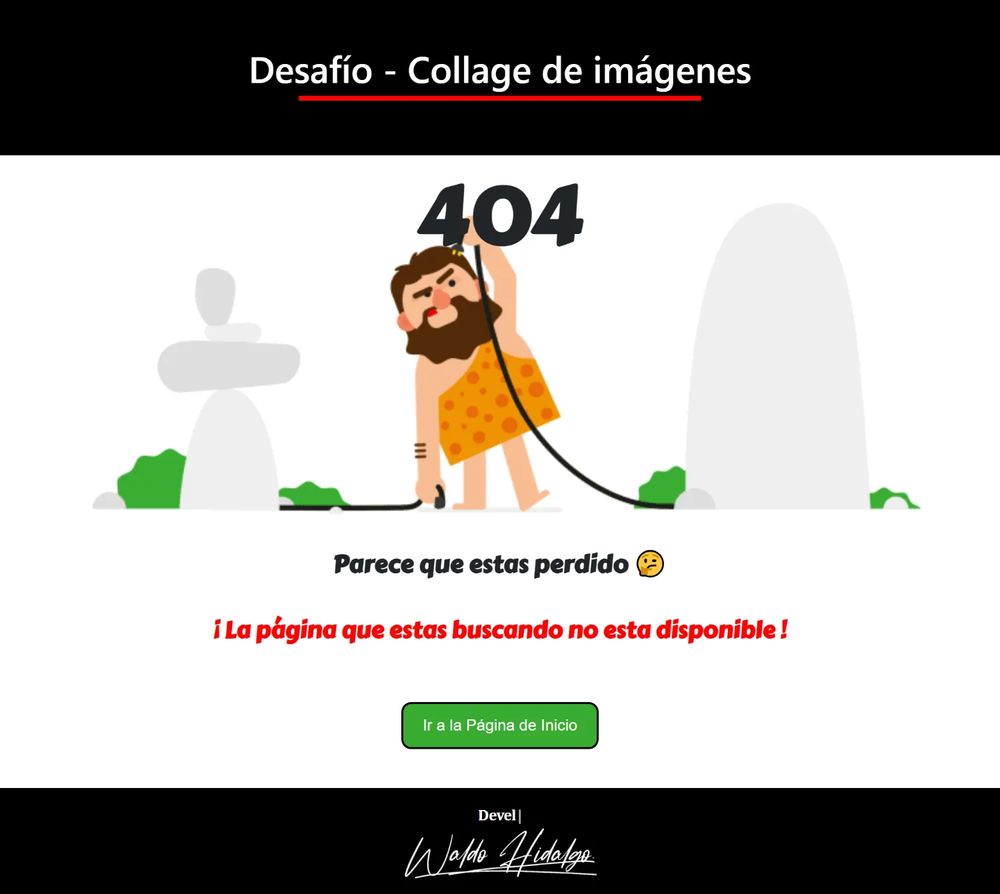

#### 4-413 en Pantallas Grandes

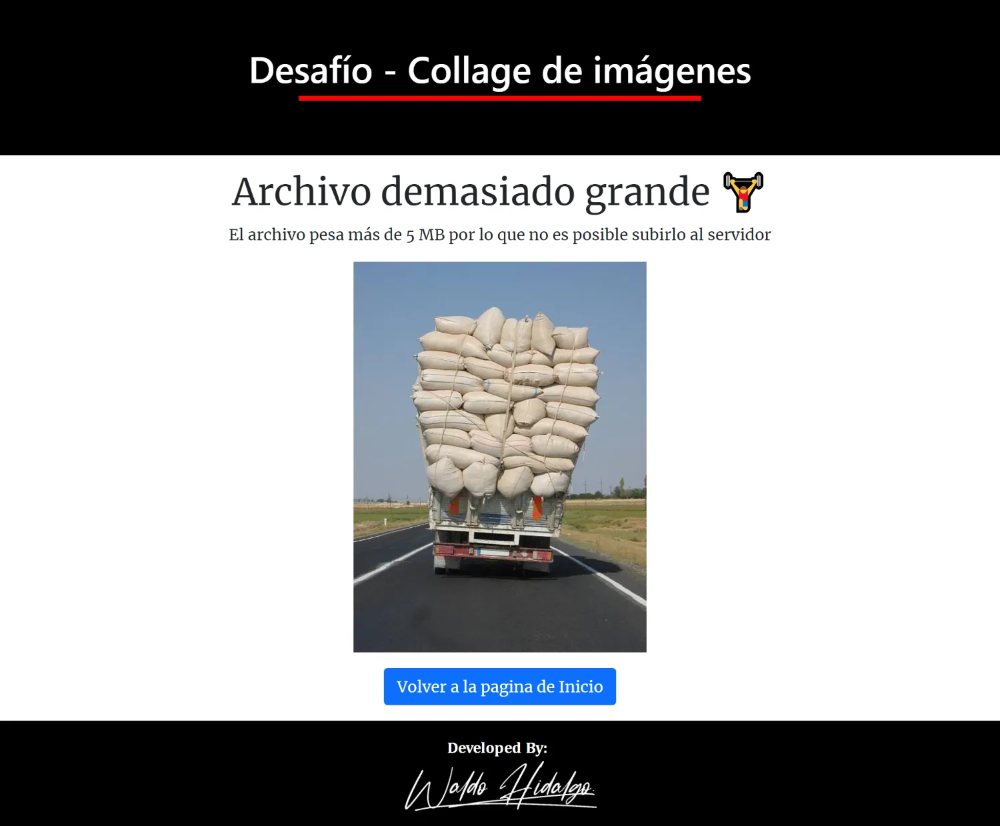

### Proyecto en Pantallas Small

#### 1-Home en Pantallas Small


#### 2-Collage en Pantallas Small

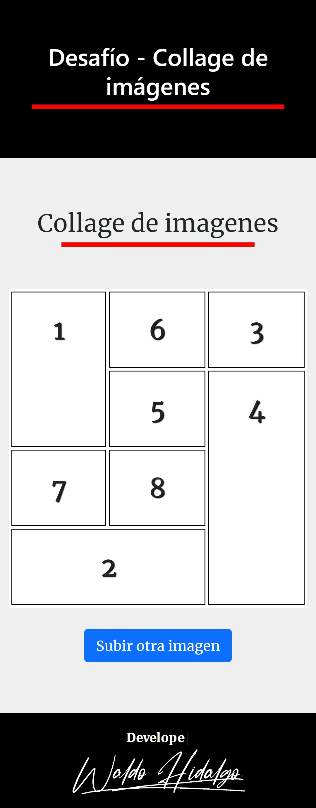

#### 3-404 en Pantallas Small


#### 4-413 en Pantallas Small

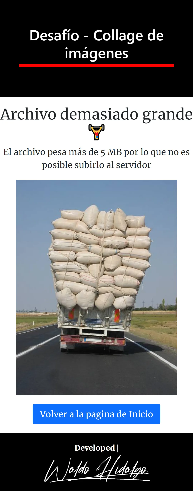

## Diagrama de Flujo

### 1-Carga de Imagen

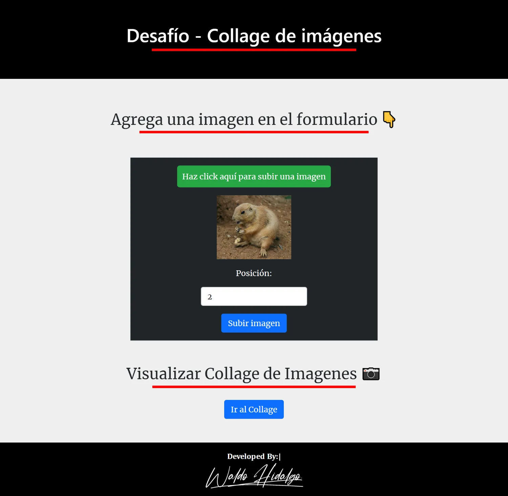

### 2-Muestra en collage page de imagen cargada

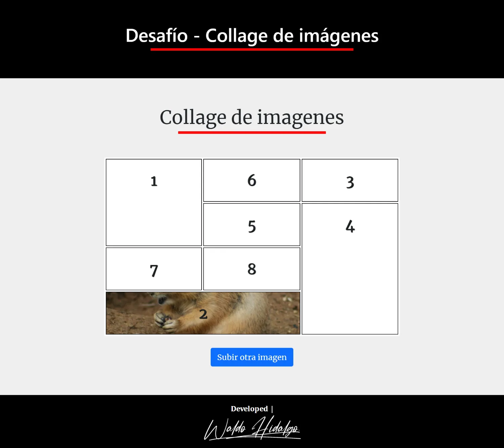

### 3-Collage Completado

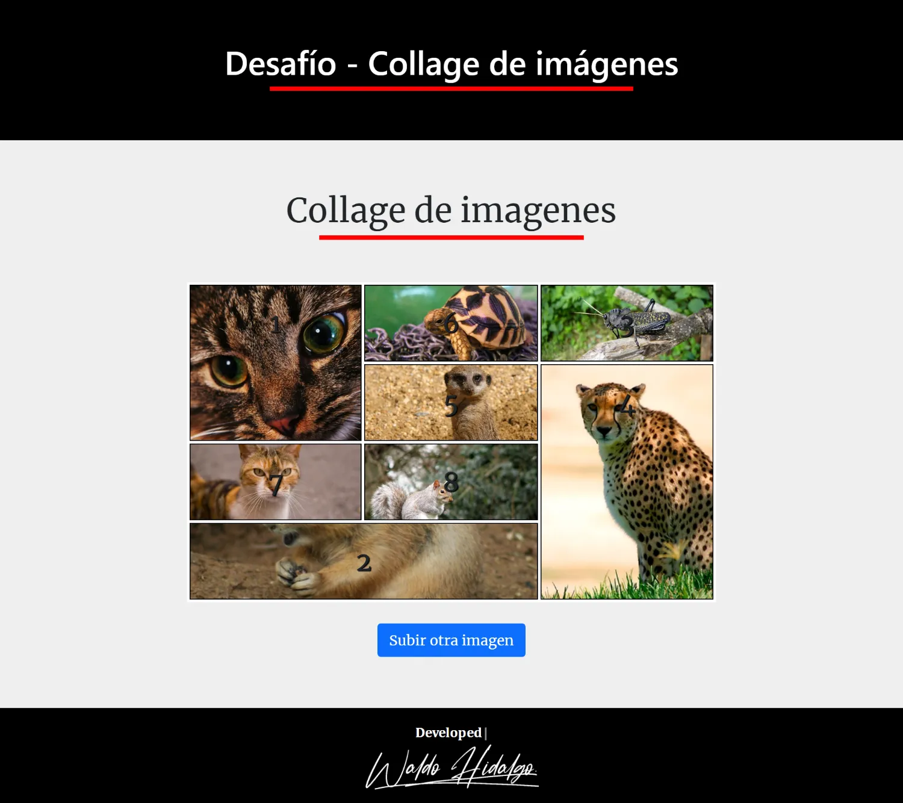

### 4-Collage Completado Small Screen


### 5-Collage Recompletado con nuevas imagenes

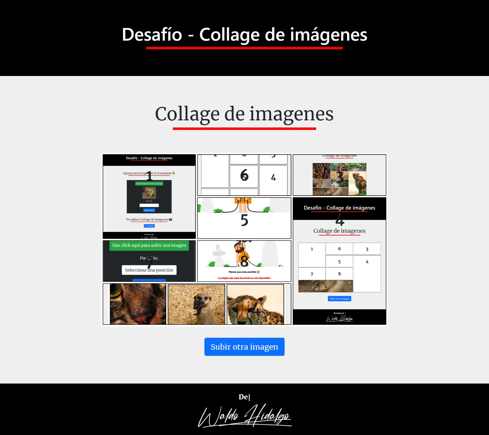

## Soluciones

### 1. Integrar express-fileupload a Express. (1 Punto)

Se ha integrado express-fileupload tal y como muestro a continuación:

```js
import fileUpload from "express-fileupload";
```

### 2. Definir que el límite para la carga de imágenes es de 5MB. (2 Puntos)

Con la intención de renderizar una vista personalizada he manipulado el tamaño en el siguiente middleware (se muestra una vista personalizada cuando el tamaño del archivo es mayor a 5 MB):

```js
export function crearImagen(req, res) {
  const { target_file } = req.files;
  const { posicion } = req.body;

  if (Object.keys(target_file).length === 0) {
    res.status(400).send("Ningun archivo ha sido subido");
    return;
  }
  if (target_file.size > 5 * 1024 * 1024) {
    res.status(413).render("pages/413");
    return;
  }
  target_file.mv(
    path.resolve("assets", "imagenes", `imagen-${posicion}.jpg`),
    (err) => {
      if (err) {
        console.log("Error77", err);
        res.send("Error");
        return;
      }
      console.log("Imagen guardada con exito");
      res.render("pages/collage");
    }
  );
}
```

### 3. Responder con un mensaje indicando que se sobrepasó el límite especificado. (2 Puntos)

Respondo con más que un simple mensaje sino que respondo con una vista personalizada siguiente:


### 4. Crear una ruta POST /imagen que reciba y almacene una imagen en una carpeta pública del servidor. Considerar que el formulario envía un payload con una propiedad “position”, que indica la posición del collage donde se deberá mostrar la imagen. (3 Puntos)

He creado la siguiente ruta post que cumple con lo solicitado:

```js
router.post("/imagen", crearImagen);
```

Dicha ruta utiliza la siguiente función **crearImagen**:

```js
export function crearImagen(req, res) {
  const { target_file } = req.files;
  const { posicion } = req.body;

  if (Object.keys(target_file).length === 0) {
    res.status(400).send("Ningun archivo ha sido subido");
    return;
  }
  if (target_file.size > 5 * 1024 * 1024) {
    res.status(413).render("pages/413");
    return;
  }
  target_file.mv(
    path.resolve("assets", "imagenes", `imagen-${posicion}.jpg`),
    (err) => {
      if (err) {
        console.log("Error77", err);
        res.send("Error");
        return;
      }
      console.log("Imagen guardada con exito");
      res.render("pages/collage");
    }
  );
}
```

### 5. Crear una ruta DELETE /imagen/:nombre que reciba como parámetro el nombre de una imagen y la elimine de la carpeta en donde están siendo alojadas las imágenes. Considerar que esta interacción se ejecuta al hacer click en alguno de los números del collage. (2 Puntos)

He creado la siguiente ruta delete que cumple con lo solicitado:

```js
export async function deleteImagen(req, res) {
  try {
    const { nombre } = req.params;
    if (nombre) {
      console.log("Eliminada con exito ", nombre);
      await fs.unlink(path.resolve("assets", "imagenes", nombre));

      res
        .status(200)
        .set("Cache-Control", "no-cache, no-store, must-revalidate")
        .send("exito");
    }
  } catch (error) {
    res.status(500).send(error);
  }
}
```

## Extra

He creado 2 maneras para resetear la data e impedir la persistencia de data no deseada en mi proyecto. El primer método es resetear la data vía una ruta la cual es la siguiente:

```js
router.get("/reset", resetData);
```

Dicha ruta utiliza la siguiente función:

```js
export async function resetData(req, res) {
  const carpeta = path.resolve("assets", "imagenes");
  try {
    const archivos = await fs.readdir(carpeta);
    for (const archivo of archivos) {
      const rutaArchivo = path.join(carpeta, archivo);
      await fs.unlink(rutaArchivo);
    }
    console.log("Data reseteada con exito");
    res.send("Data reseteada con exito 😄");
  } catch (error) {
    res.send("Error al resetear la data");
  }
}
```

El segundo método es resetear la data cada 15 minutos vía el intervalo siguiente:

```js
setInterval(async () => {
  const carpeta = path.resolve("assets", "imagenes");
  try {
    const archivos = await fs.readdir(carpeta);
    if (archivos.length > 0) {
      for (const archivo of archivos) {
        const rutaArchivo = path.join(carpeta, archivo);
        await fs.unlink(rutaArchivo);
      }
      console.log("Data reseteada con exito");
    }
  } catch (error) {
    console.log("Error al resetear la data");
  }
}, 900000);
```
